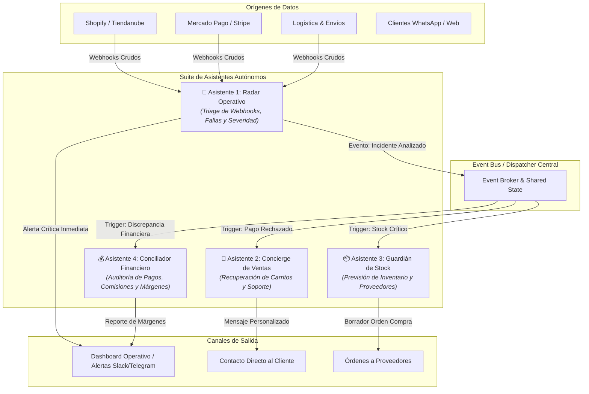

# 🏛️ Arquitectura del Ecosistema ChangaredIA

## 1. Visión y Propósito

**ChangaredIA** es un ecosistema modular de **asistentes autónomos especializados con Inteligencia Artificial** diseñado para operar, proteger y optimizar tiendas online y comercios digitales.

En lugar de construir un monolito rígido, ChangaredIA opera bajo el paradigma de **Sistemas Multi-Agente Orientados a Eventos (Event-Driven Multi-Agent Architecture)**, donde cada asistente tiene una responsabilidad acotada, autonomía de decisión y canales de comunicación estandarizados.

---

## 2. Mapa del Ecosistema de Asistentes



---

## 3. Especificación de los Asistentes

### 📡 Asistente 1: Radar Operativo (`radar-operativo`)
- **Estado:** ✅ Diseñado y codificado en carpeta modular.
- **Misión:** Monitoreo centinela 24/7 de la operativa técnica y transaccional.
- **Capacidades:**
  - Ingesta de webhooks con acuse inmediato (`202 Accepted`).
  - Triage con IA para clasificar eventos en `PAGO`, `STOCK`, `LOGISTICA`, `OTRO`.
  - Graduación de severidad: `Baja`, `Media`, `Alta`.
  - Fallback heurístico determinista si no hay conexión al LLM.
  - Bitácora de trazas en memoria y archivo estructurado en disco.

---

### 💬 Asistente 2: Concierge de Ventas y Recuperación (`sales-concierge`)
- **Estado:** 🗓️ Propuesto / Fase 2.
- **Misión:** Rescatar transacciones fallidas y brindar atención personalizada sin fricción.
- **Interacción con el Radar:**
  - Cuando el **Radar Operativo** detecta un `PAGO` rechazado (ej. por límite de tarjeta o validación de seguridad), el Concierge toma el relevo:
    - Genera un mensaje contextual y amigable para el cliente vía WhatsApp / Correo.
    - Proporciona un enlace directo para reintentar el pago con métodos alternativos.
    - Asiste en dudas de producto o promociones vigentes.

---

### 📦 Asistente 3: Guardián de Inventario y Suministro (`stock-sentinel`)
- **Estado:** 🗓️ Propuesto / Fase 3.
- **Misión:** Prevenir quiebres de stock y roturas de inventario antes de que ocurran.
- **Interacción con el Radar:**
  - Cuando el **Radar Operativo** reporta un incidente de `STOCK` crítico:
    - Si el producto llegó a stock 0, solicita pausar la publicación en el canal de ventas.
    - Calcula la velocidad de venta histórica (Runway) para predecir cuándo se agotarán variantes relacionadas.
    - Redacta un borrador de solicitud de reposición al proveedor configurado.

---

### 💰 Asistente 4: Conciliador Financiero y Márgenes (`finance-reconciler`)
- **Estado:** 🗓️ Propuesto / Fase 4.
- **Misión:** Proteger la rentabilidad y asegurar la concordancia entre cobros, comisiones y costos.
- **Capacidades:**
  - Audita que las comisiones cobradas por Mercado Pago o pasarelas coincidan con el plan contratado.
  - Detecta cobros duplicados, contracargos o retenciones indebidas.
  - Alerta si un producto se está vendiendo por debajo del margen mínimo debido a costos de logística o promociones acumuladas.

---

## 4. Contrato Estándar de Eventos Inter-Asistente

Para que los asistentes se comuniquen de forma desacoplada, todos los eventos compartidos siguen el siguiente esquema JSON:

```json
{
  "$schema": "https://json-schema.org/draft/2020-12/schema",
  "eventId": "EVT-20261003-9821AF",
  "sourceAssistant": "radar-operativo",
  "timestamp": "2026-10-03T13:10:00.000Z",
  "eventType": "INCIDENT_EVALUATED",
  "payload": {
    "incidentId": "INC-1772541800000-A4B1F2",
    "categoria": "PAGO",
    "gravedad": "Media",
    "diagnostico": "Pago rechazado por fondos insuficientes tras 2 intentos.",
    "proximoPaso": "Enviar enlace de recuperación de pago al cliente.",
    "contextoCliente": {
      "email": "cliente@correo.com",
      "monto": 8500.00,
      "moneda": "ARS"
    }
  }
}
```

---

## 5. Estructura de Directorios del Repositorio

```
ChangaredIA/
├── .gitignore
├── README.md
├── docs/
│   └── ARCHITECTURE.md          # Este documento
├── assistants/
│   ├── .gitkeep
│   ├── radar-operativo/         # [Asistente 1: Listo para mover/vincular]
│   ├── sales-concierge/         # [Asistente 2: Planificado]
│   ├── stock-sentinel/          # [Asistente 3: Planificado]
│   └── finance-reconciler/      # [Asistente 4: Planificado]
├── shared/
│   ├── contracts/               # Tipos y esquemas de eventos comunes
│   └── logger/                  # Utilidades compartidas de trazabilidad
└── scripts/
    └── dev-all.sh / dev-all.bat # Scripts para levantar los servicios del ecosistema
```
